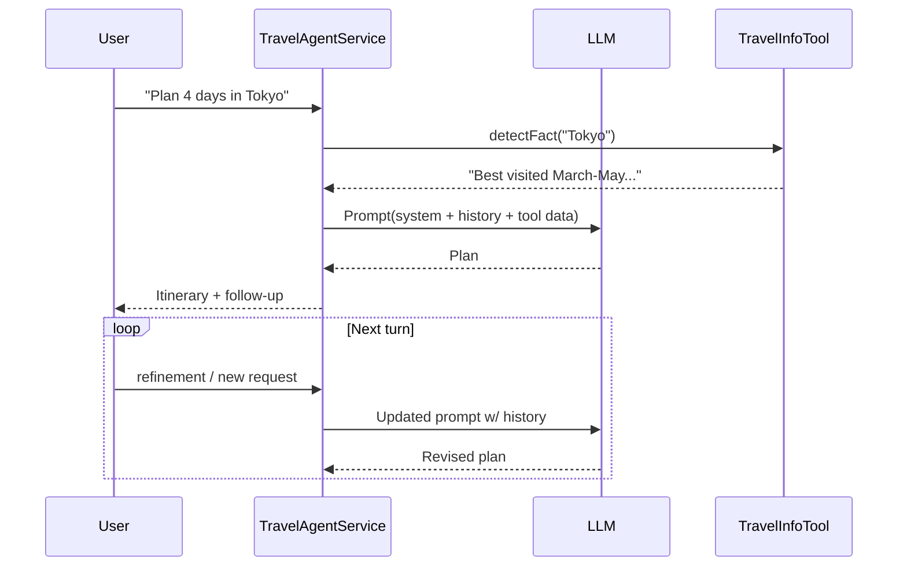

# Agentic AI Assessment for Travel Agent

## 1. What Makes Agentic Systems Distinct?

Agentic AI systems combine four distinguishing characteristics:

1. **Goal-Oriented Autonomy** – They pursue high-level objectives framed in natural language and decide how to satisfy them rather than executing a single, fixed prompt.
2. **Stateful Memory** – They retain dialogue or task context so each response considers prior interactions, enabling multi-turn reasoning and plan refinement.
3. **Reasoning + Decision Loop** – They iteratively interpret input, choose actions (which can include tools), evaluate outcomes, and continue until the goal is met.
4. **Tool/Environment Interaction** – They can invoke external tools, data sources, or APIs to enrich their reasoning beyond the base model.

### Mini Example: Agent Loop vs. Traditional Call



Traditional prompt apps stop after a single `User -> LLM` call; agents keep looping with memory + tools.

### Agentic Terminology: What Are “Tools” (a.k.a. Functions)?

In agentic systems, **tools** (also known as *functions*, *plugins*, or *abilities*) are pre-defined operations the model can request when it needs knowledge or actions that are not encoded in its weights. Tools typically:

- expose a typed interface (`function name`, parameters, return type),
- encapsulate external information (e.g., databases, APIs) or actions (booking, notifications),
- are invoked by the agent when certain intent patterns are detected, and
- return structured results that the agent weaves into its reasoning loop.

**Definition requirements.** Frameworks expose tools to the LLM through structured metadata—usually name + description + parameter schema. Requirements vary:

- **Semantic Kernel:** Use annotations like:

  ```java
  @DefineKernelFunction(
      name = "destination_facts",
      description = "Returns planning insights for a given city")
  public String destinationFacts(
      @KernelFunctionParameter(name = "city", description = "Destination city")
      String city) { ... }
  ```

  SK auto-generates the JSON schema the LLM sees and routes invocation automatically.

- **Spring AI / OpenAI function calling APIs:** Provide a JSON schema describing each tool. Names should be short verbs (`destination_facts`), descriptions concise but specific, and parameters typed (string, number, enums). While there’s no universal naming mandate, clear, descriptive names and parameter docs dramatically improve the model’s ability to pick the right tool.
- **Middleware-injected tools (current Spring AI branch):** Because the application decides when to run the tool, no annotations are required; clarity still matters if you later expose the tool to the model.

#### How Are Tools Invoked?

There are two common mechanics:

1. **Model-directed invocation (function calling):** The agent runtime exposes tool signatures to the LLM. When the model predicts a function call (e.g., `{"tool":"destination_facts","arguments":{"city":"Paris"}}`), the runtime programmatically invokes the Java method, captures the result, and feeds it back into the model. This is what the Semantic Kernel branch does via `KernelPluginFactory` + `@DefineKernelFunction`.
2. **System-directed invocation (middleware injection):** The application inspects the conversation, decides when a tool is relevant, executes it, and inserts the output into the prompt before hitting the LLM. The Spring AI branch currently uses this approach: `TravelInfoTool.detectFact(...)` runs in `TravelAgentService`, and the returned advice is added as a `SystemMessage`, effectively simulating a tool call until Spring AI’s native tool-calling API is available.

Both approaches are agentic: one lets the model decide when to call, the other lets the orchestration layer decide. Engineers can choose the pattern that best fits the capabilities of their framework/runtime.

**How this app implements tools**

- In the **Semantic Kernel branch**, `TravelInfoTool` is turned into a SK plugin via `@DefineKernelFunction`. When the LLM predicts it needs `destination_facts`, Semantic Kernel routes the call, collects the return value, and feeds it back into the conversation automatically.
- In the **Spring AI branch**, the same tool logic lives in `TravelInfoTool`, but the LLM doesn’t call it directly. Instead, the service inspects the user message via `detectFact(...)` and injects the tool output into the prompt as an additional `SystemMessage`. This keeps the architecture agentic (the tool augments reasoning) while avoiding unresolved Spring AI tool-calling features today.

**Is the travel-agent an Agentic AI application?**  
Yes. It accepts open-ended travel-planning goals, keeps a conversation memory, injects domain knowledge via the `TravelInfoTool`, and lets the LLM autonomously craft itineraries by looping through “understand → plan → respond.”

## 2. How the Application Satisfies Agentic Requirements

- **Goal-driven autonomy:** The system prompt (“You are a helpful travel concierge…”) defines the agent’s mission. Each request (e.g., “Plan 4 days in Tokyo”) is handled by reasoning over that mission, not by a static template.
- **Persistent state:** `ConversationState` stores the entire dialogue per `conversationId`, allowing the agent to iterate on prior plans, remember constraints, and maintain context.
- **Reasoning loop:** For every turn, `TravelAgentService` rebuilds the prompt from system instructions + history + tool output, calls the LLM, receives a plan, appends it to history, and waits for the next user instruction—classic agent loop behavior.
- **Tool integration:** `TravelInfoTool` injects destination facts when the user’s message references a supported city. In the Semantic Kernel branch this is a plugin; in the Spring AI branch the info is fed into the prompt as contextual guidance. Either way, the agent augments its reasoning with structured knowledge.

```java
public ChatResponse handleTurn(ChatRequest request) {
    ConversationState state = conversations.computeIfAbsent(id, ConversationState::new);
    state.addMessage(AgentMessage.user(request.getMessage()));   // memory
    Prompt prompt = new Prompt(buildPromptMessages(state.snapshot(), request.getMessage()),
                               AzureOpenAiChatOptions.fromOptions(defaultOptions)); // goal + tool data
    String reply = chatModel.call(prompt).getResult().getOutput().getText(); // reasoning
    state.addMessage(AgentMessage.assistant(reply));              // loop continues
    return buildResponse(state);
}
```

Traditional apps would send `request.getMessage()` straight to the model; here every turn is mediated by history + tools, making it agentic.

## 3. Benefits Over Traditional Applications

| Capability | Agentic Travel Agent | Traditional CRUD/Prompt App |
|------------|----------------------|------------------------------|
| **Adaptive planning** | Crafts bespoke itineraries, negotiates trade-offs (budget vs. time) through dialogue. | Requires predefined flows or human-authored templates. |
| **Context retention** | Remembers earlier legs of the trip, user preferences, and updates plans incrementally. | Loses context after each request unless manually re-sent. |
| **Tool awareness** | Can combine LLM reasoning with domain facts/tools (today: destination facts; future: flights, hotels). | Needs explicit programming for every data lookup. |
| **User experience** | Feels like a concierge that iterates with the traveler until satisfied. | Feels like a form submission or FAQ. |

In short, an agentic application like this bridges human intent (“plan my trip”) and heterogeneous back-end knowledge without rigid workflows. It unlocks personalized planning, proactive guidance, and future extensibility (more tools, memories, planners) that traditional applications would implement through far more code and brittle logic.
